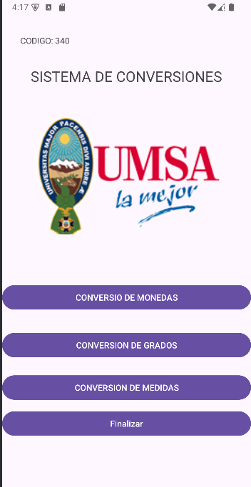
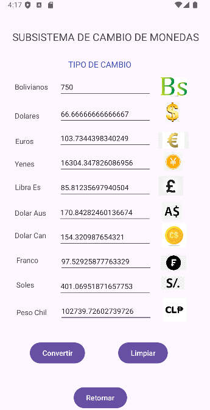
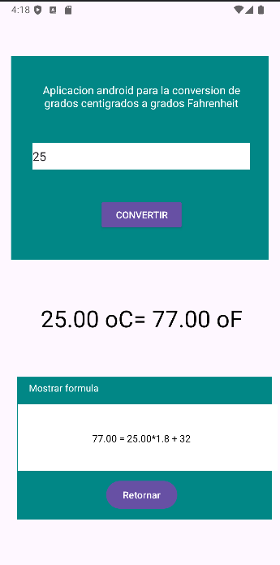
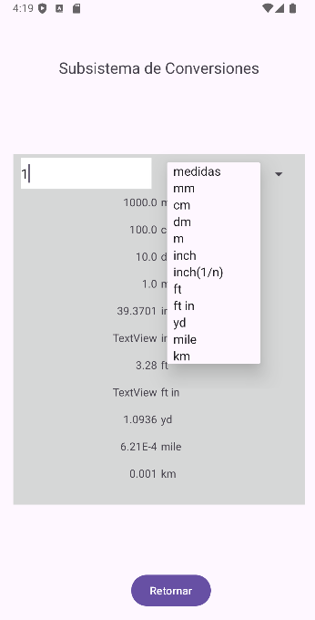

# Conversor Android 📱

Una aplicación Android desarrollada en Java/Kotlin que permite realizar conversiones entre distintas unidades:

- 🔁 Conversión de medidas (metros, kilómetros, pulgadas, pies, etc.)
- 💱 Conversión de divisas (bolivianos, dólares, euros, etc.)
- 🌡️ Conversión de temperatura (°C, °F)

## ✨ Características

- Interfaz intuitiva y amigable
- Varias pantallas con navegación entre actividades
- Validación de entradas
- Cálculos precisos y en tiempo real

## 📷 Capturas de pantalla

|  |  |  |  |

## ⚙️ Tecnologías usadas

- Android Studio
- Java
- XML

## 🧠 Autor

**Gadiel Plata Yupanqui**  
📍 Bolivia

